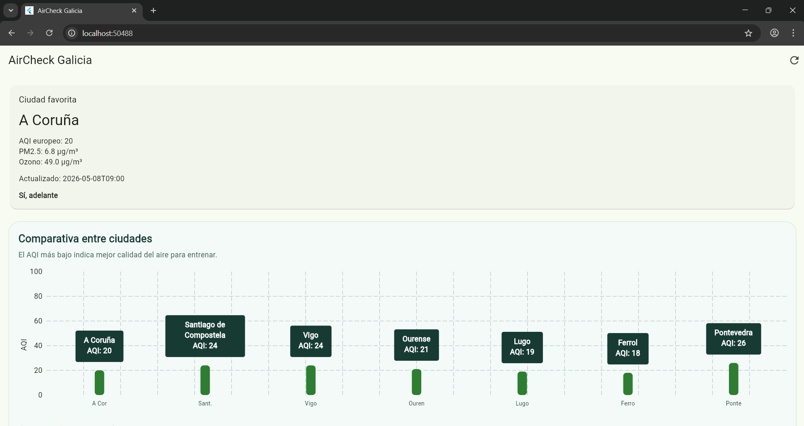
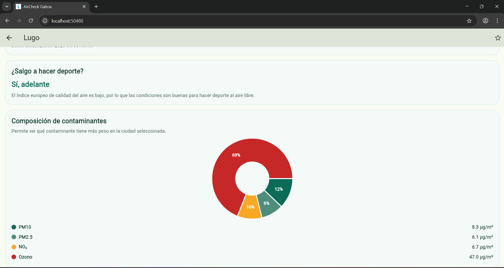
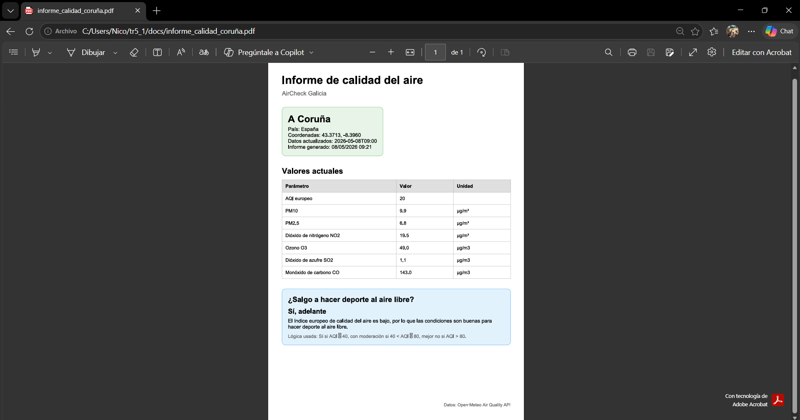

# AirCheck Galicia

AirCheck Galicia es una aplicación Flutter para consultar la calidad del aire en varias ciudades de Galicia.

La aplicación está pensada para una persona que hace deporte al aire libre y quiere saber de forma rápida si las condiciones del aire son adecuadas antes de salir a correr o montar en bici. Para ello se consultan datos reales de Open-Meteo y se muestran en una pantalla principal, una pantalla de detalle y un informe PDF.

## Funcionalidades principales

- Consulta de calidad del aire en varias ciudades gallegas.
- Ciudad favorita visible al abrir la aplicación.
- Comparativa del AQI europeo entre ciudades.
- Detalle de contaminantes de cada ciudad.
- Recomendación sencilla para hacer deporte al aire libre.
- Generación de informe PDF.
- Recarga manual de datos.

## Capturas

### Pantalla principal



### Pantalla de detalle



### PDF generado



## Tecnologías utilizadas

- Flutter
- Dart
- Open-Meteo Geocoding API
- Open-Meteo Air Quality API
- `http: ^1.2.2`
- `provider: ^6.1.2`
- `fl_chart: ^0.69.0`
- `pdf: ^3.11.1`
- `printing: ^5.13.4`

## Arquitectura del proyecto

El proyecto está organizado siguiendo una estructura MVVM.

- `models/`: contiene las clases de datos principales.
- `data/`: contiene la API y el repositorio.
- `viewmodels/`: contiene el estado de la aplicación.
- `views/`: contiene las pantallas.
- `widgets/`: contiene widgets reutilizables, como las gráficas.
- `services/`: contiene servicios auxiliares, como la generación de PDF.

La vista no llama directamente a la API. La pantalla observa el ViewModel, el ViewModel pide los datos al repositorio y el repositorio usa la clase encargada de hacer las peticiones HTTP.

## Fuente de datos

La aplicación utiliza Open-Meteo:

- Geocoding API: para buscar ciudades y obtener coordenadas.
- Air Quality API: para obtener los datos actuales de calidad del aire.

Documentación oficial:

- https://open-meteo.com/en/docs/geocoding-api
- https://open-meteo.com/en/docs/air-quality-api

## Gráficas utilizadas

### Gráfica de barras

La gráfica de barras compara el AQI europeo entre las ciudades consultadas. Se utiliza porque permite ver rápidamente qué ciudad tiene mejor o peor calidad del aire.

### Gráfica circular

La gráfica circular muestra el peso de los principales contaminantes en la ciudad seleccionada. Sirve para ver qué contaminante destaca más en ese momento.

## Instalación y ejecución

Clonar el repositorio:

```bash
git clone https://github.com/nico-techh/tr5_1.git